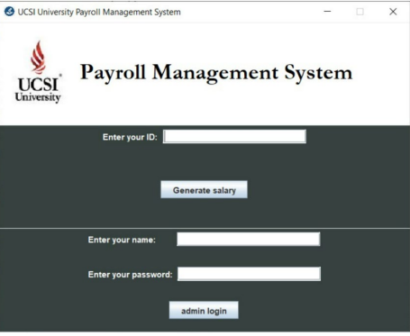

# Employee Payroll System
## Project Background
Our Payroll Managament System able to generate Salary Slip to the employess while basic salary and bonus are updated by admin. To simulate our project in real life, we have developed an Employee Payroll Management System based on our University ***UCSI University***. This system will be developed using Java Programming, SQL as the Database, and MySQL as the Database Management System. <br />
<br />
We have created three Graphical User Inteface (GUI) which are Login GUI, Admin GUI, and Salary Slip GUI. The snapshot of each GUI will be shown in System Design. 

## System Design
### Flowchart


### GUIs
We have used components from Swing and AWT Libraries to design the GUI. <br />

#### Login GUI

Login GUI is the first GUI that user will be seeing when he/she runs the application. If the user is an employee, he/she can proceed to check the salary slip provided administrator has updated their salary. If the user is an administrator, he/she shall enter the username and password. If you want to change the password and user, you will need to change it at *LoginGUI.java* at following lines: <br />
```
if (stradmin.equals("admin") && strpass.equals("admin")) {
```
***'admin' is the username and password in our employee payroll management system***

#### Admin GUI


Admin GUI consists of the following features:
- Add New Employees
- Display Employee Information
- Salary Calculation based on Days and Rate Per Day

#### Salary Slip GUI


This GUI is used to display Salary to employee after user key in his/her ID in the Login GUI. It has the 'print' button that allow user to print the salary slip to PDF. 

## :raised_hands: Project Members
- Lim Zhi Min
- Ahmed Rafat
- Bryan Keane
- Kong Ping Hao
